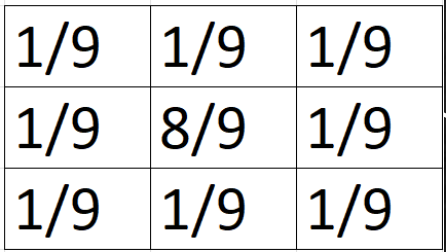
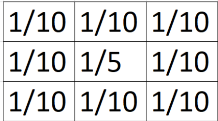

# Jurnal Modul Deteksi Tepi dan Perbaikan Kualitas Citra

> Additional notes

- Jangan merubah struktur folder yang ada
- Gambar terkait sudah tersimpan di folder ./assets
- Pastikan hasil sesuai dengan **Expected Result** pada ./modul.pdf
- Overtime tidak menjamin apa yang dirimu kerjakan sesuai dengan ekspetasi. Jadi kerjakan sewajarnya dan jangan dipaksakan...

### Soal Pertama

Perbaikilah kualitas citra dari gambar yang tersedia dengan menggunakan:

- Kernel 3x3 berisi 1/9 dengan metode Mean, Median dan Modus
- Kernel 9x9 dengan berisi 1/81 dengan metode yang sama seperti poin sebelumnya

> Contoh

Lalu deteksi tepi untuk semua jenis perbaikan tadi dengan operator Sobel, Prewitt dan Robert pada gambar ./assets/manchester_united.jpeg

